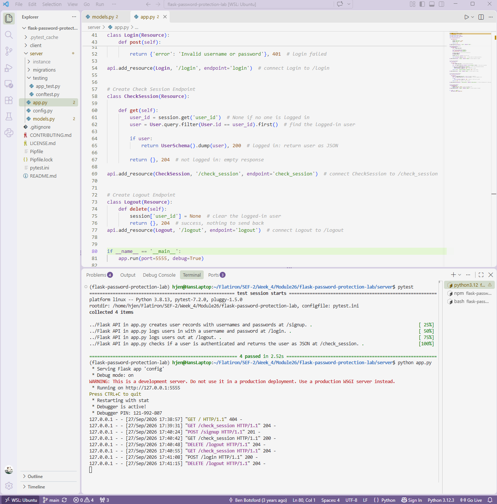

# Password Protection Lab
**Completed Sept 27, 2026**

A full-stack authentication app with a Flask API backend and a React frontend. Users can sign up, log in, stay logged in across page refreshes, and log out. Passwords are never stored in plain text: they are hashed with bcrypt before being saved to the database.
 



## Features
 
- **Sign up** with a username and password. The password is hashed with bcrypt and the user is logged in automatically.
- **Log in** with a username and password. Incorrect passwords are rejected with a `401 Unauthorized` response.
- **Stay logged in** after a page refresh. The React app checks the session on load.
- **Log out**, which clears the user from the session.
- **Protected password hashes.** Reading `user.password_hash` raises an error, and hashes are never included in JSON responses.
## Technologies
 
- Python 3.8, Flask, Flask-RESTful
- Flask-SQLAlchemy, Flask-Migrate, SQLite
- Flask-Bcrypt
- Marshmallow (serialization)
- React (provided frontend)
- pytest
## Installation
 
Clone the repository, then from the project root run:
 
```bash
pipenv install && pipenv shell
npm install --prefix client
cd server
flask db upgrade head
```
 
## Usage
 
Start the Flask server from the `server` folder (it runs on port 5555):
 
```bash
python app.py
```
 
In a second terminal, start the React app from the project root:
 
```bash
npm start --prefix client
```
 
Then open the address shown in the terminal to use the app.
 
## API Endpoints
 
| Method | Endpoint         | Description                                                        | Success Response        |
| ------ | ---------------- | ------------------------------------------------------------------ | ----------------------- |
| POST   | `/signup`        | Creates a user with a hashed password and logs them in             | `201` with user JSON    |
| POST   | `/login`         | Verifies the username and password and logs the user in            | `200` with user JSON    |
| GET    | `/check_session` | Returns the logged-in user, or an empty response if no one is logged in | `200` with user JSON, or `204` |
| DELETE | `/logout`        | Removes the user from the session                                  | `204` empty response    |
| DELETE | `/clear`         | Resets the session (provided with the starter code)                | `204` empty response    |
 
A failed login returns `401` with `{"error": "Invalid username or password"}`. The message is deliberately vague so it doesn't reveal which usernames exist.
 
## How Password Security Works
 
The `User` model stores the hash in a private `_password_hash` column and controls access through a `password_hash` hybrid property:
 
- **Getter:** raises an `AttributeError`, so the hash can't be read through the property.
- **Setter:** hashes the plain-text password with `bcrypt.generate_password_hash()` and stores only the hash. The plain-text password is never saved.
- **`authenticate(password)`:** uses `bcrypt.check_password_hash()` to compare a login attempt against the stored hash, returning `True` or `False`.
Bcrypt adds a random salt to every hash, so two users with the same password end up with different hashes in the database.
 
Login state is tracked with Flask's `session`. Signing up or logging in sets `session['user_id']`, checking the session reads it, and logging out clears it.
 
## Running Tests
 
From the `server` folder:
 
```bash
pytest -x
```
 
All four tests pass, covering signup, login, logout, and session checking.
 
 
## Project Structure
 
```
flask-password-protection-lab/
├── client/               # React frontend (provided)
├── server/
│   ├── app.py            # API resources: Signup, Login, CheckSession, Logout
│   ├── config.py         # App, database, API, and bcrypt setup
│   ├── models.py         # User model with password hashing and UserSchema
│   ├── migrations/       # Database migrations
│   └── testing/          # pytest test suite
├── flask-password-lab.png
├── Pipfile
└── README.md
```